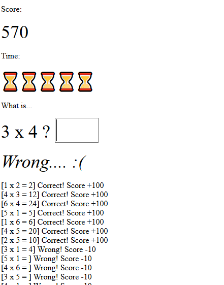

# multiplication-game

Simple Javascript based multiplication game for elementary student

Adjust the settings from the Javascript variables:

```
var maxtime = 10;
var max_a = 6;
var max_b = 6;
var correct_score = 100;
var wrong_score = -10;
```

Then open the HTML file from the browser. That's all.



